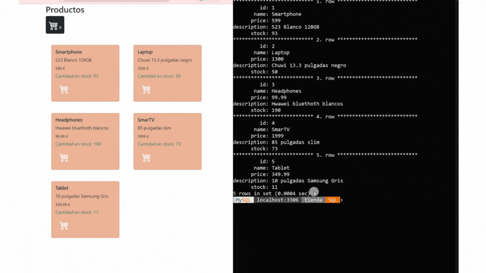

   

  

 

    

 
 
### carrito con MySql y PHP
✅productos almacenados en bbdd
✅pedidos realizados se almacenan en bbdd
✅actualización de stock tras cada compra
✅POO

 
 

  <h3  align="center">
    <pre>💻Hecho con PHP🐘 y 💝  </pre> 
  <h3/>

  <a href="https://www.linkedin.com/in/emmily-santos-a6851327b?utm_source=share&utm_campaign=share_via&utm_content=profile&utm_medium=android_app">Linkedin</a>
